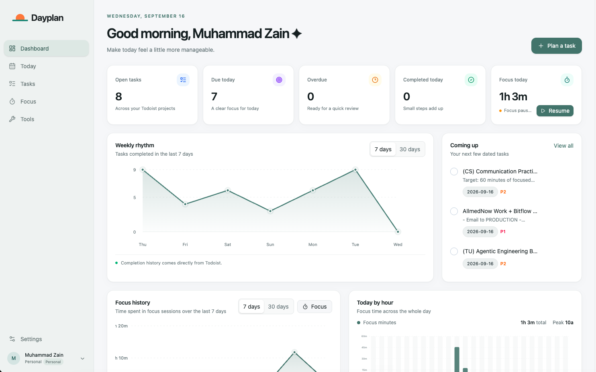

<h1 align="center">
  <picture>
    <source media="(prefers-color-scheme: dark)" srcset="assets/branding/dayplan-logo-dark.svg">
    <source media="(prefers-color-scheme: light)" srcset="assets/branding/dayplan-logo-light.svg">
    
  </picture>
</h1>

<p align="center">A calm, local-first desktop workspace for planning tasks and protecting your focus.</p>

<p align="center">
  <a href="LICENSE"></a>
  
  
  
  
  
</p>

<p align="center">
  <a href="#preview">Preview</a> ·
  <a href="#features">Features</a> ·
  <a href="#run-locally">Run locally</a> ·
  <a href="#connect-an-mcp-client">MCP API</a> ·
  <a href="#local-data-and-privacy">Privacy</a>
</p>

Dayplan is a macOS and Windows desktop app for keeping Todoist work, local focus sessions, and multiple personal workspaces in one quiet, dependable place. Your data stays on your device while Todoist remains the source of truth for remote tasks.

## Preview

<p align="center">
  
</p>

## Features

### Plan your work

- **Dashboard** — See open, due, overdue, and completed Todoist tasks alongside priority and completion summaries.
- **Today and Tasks** — Search, create, edit, complete, reopen, and delete tasks from focused task views.
- **Task details** — Set Inbox or project, due date, priority, description, and labels while composing a task.

### Protect your focus

- **Focus timer** — Run 1–240-minute focus intervals or 1–120-minute breaks with pause, resume, and time adjustment controls.
- **Focus insights** — Review hourly focus across the day and daily history derived from active intervals; pauses and breaks are excluded.
- **Desktop alerts** — Receive a notification and audible alert when focus or break timers finish, with menu-bar and system-tray controls.

### Workspaces that stay yours

- **Multiple workspaces** — Keep independent Todoist tokens, focus settings, and focus history in each workspace. Rename, archive, and restore spaces without deleting remote tasks.
- **Guided onboarding** — Set your owner name, workspace, Todoist connection, and timer defaults on first launch or when creating a new workspace.
- **Local-first storage** — Store the owner profile, workspace selection, settings, and focus history in SQLite on your device.

### Local automation

- **MCP tools** — Use nineteen workspace-scoped tools for Todoist tasks, completed-task history, projects, labels, focus controls, and statistics over stdio or opt-in local HTTP.
- **Safe boundaries** — Validated task writes and timer controls run immediately; permanent task deletion asks for confirmation because Todoist also deletes subtasks.

Focus duration defaults to 30 minutes and break duration to five minutes. See the [architecture notes](ARCHITECTURE.md#focus-timer) for behavior and data boundaries.

## Requirements

- Node.js 24 or later and npm.
- macOS or Windows for local desktop execution. Native modules must be installed/rebuilt on the target operating system.

macOS native notifications require a code-signed app; unsigned builds may not display them. Tray controls and timer state remain available.

## Run locally

```sh
npm install
npm run dev
```

Run checks:

```sh
npm run typecheck
npm test
npm run build
```

Package on the current OS:

```sh
npm run build
npx electron-builder --mac dmg
npx electron-builder --win nsis
```

The package for each operating system is built on that OS. GitHub Actions will build and upload both installers from the release workflow.

## Connect an MCP client

Dayplan exposes a simple local Streamable HTTP MCP API that works with Codex and any other compatible client. It also supports stdio for clients that launch a local process:

```json
{
  "mcpServers": {
    "dayplan": {
      "command": "/path/to/Dayplan",
      "args": ["--mcp"]
    }
  }
}
```

On macOS, the executable is inside `Dayplan.app/Contents/MacOS/Dayplan`. On Windows, use the installed `Dayplan.exe`.

To use the HTTP API, open Dayplan Settings and enable **Local MCP server**, then point your client at:

```text
http://127.0.0.1:47631/mcp
```

For example, Codex can use this configuration:

```toml
[mcp_servers.dayplan]
url = "http://127.0.0.1:47631/mcp"
```

Keep Dayplan open while a client uses the server. The endpoint starts automatically whenever the setting is enabled and stops when the app quits. It listens only on `127.0.0.1`; Host and Origin headers are checked. There is no authentication, so other local applications can read and change Todoist task data. Only deleting a task requires Dayplan confirmation. Call `workspace_list` to discover active workspace IDs, then include the chosen `workspace_id` in task and focus tool calls. If port `47631` is occupied, Settings reports the problem; close the process using that port, then turn the server off and on again. The endpoint is local to the computer running Dayplan.

## Local data and privacy

Dayplan creates `dayplan.sqlite3` under Electron's per-user `userData` directory. Todoist tokens and focus-duration preferences are stored per workspace in SQLite's `workspace_settings` table; tokens are plain text at rest and remain main-process-only. Global appearance and the MCP server preference stay in the `settings` table. The owner profile, selected workspace, focus sessions, and intervals are also stored locally. The saved token is never returned to the renderer. Workspaces are local organizational boundaries: connecting the same Todoist account in multiple workspaces exposes that account's same remote tasks in each one.

The app does not read or persist an environment-variable dump and does not require a `.env` file for runtime credentials.

## Project documents

- [Architecture](ARCHITECTURE.md)
- [Code standards](CODE_STANDARDS.md)
- [Desktop implementation plan](DESKTOP_IMPLEMENTATION_PLAN.md)
- [MCP implementation plan](MCP_IMPLEMENTATION_PLAN.md)
- [Workspace and onboarding plan](WORKSPACE_IMPLEMENTATION_PLAN.md)
- [AI/MCP tool authoring skill](SKILL.md)
- [Agent instructions](AGENTS.md)
